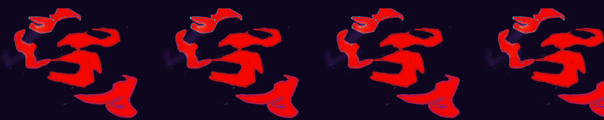

# Lorenzo Rivosecchi

I'm a Web Developer with 5 years of experience in the field. I'm currently working at [Assist Digital](https://assistdigital.com) as a Frontend Developer.
I have a background in Computer Music and my passions are music, technology and design.

> I made this picture when I was 10 using MS Paint.
Ever since I found it I have been using it as my avatar.

## Skills

I'm a passionate coder with a strong interest in user experience and accessibility. Here are a few technologies I have worked with:

## Experience

### [Assist Digital](https://www.assistdigital.com) (2023 - Present)

I'm the lead frontend developer on service line dedicated to generative AI.
I work with the team to design and develop web applications to showcase our AI solutions. My stack includes React, TypeScript, TailwindCSS, Tanstack Query, Gitlab CI/CD, Vite. 

### [La Colonia Studio](https://lacolonia.studio/) (2019 -  2023)

I worked as a frontend developer on a wide range of projects. From marketing webistes to E-Commerce and interactive web applications. During my time at La Colonia I helped the company to optimize the development process by introducing new tools and deployment strategies. My stack included React, TypeScript, Next.js, TailwindCSS, Styled Components, Github Actions, Docker and Shopify.
Here are a few examples of projects I worked on:
- [https://andreacaputo.com](https://andreacaputo.com)
- [https://karlaotto.com](https://karlaotto.com)
- [https://akfc66.gr](https://akfc66.gr/)
- [https://veneziafc.it](https://veneziafc.it)

### [Freelance](https://fibonacid.net) (2022 - Present)

I have worked on a few projects as a freelance developer. Here are a few examples:
- [https://eneatoldo.com](https://eneatoldo.com)
- [https://eneatoldo.studio](https://eneatoldo.studio)
- [https://lacortedeimiracoli.it](https://lacortedeimiracoli.it)
- [https://fibonacid.net](https://fibonacid.net)

## Education

In april 2020 I have graduated from the Milan Conservatory with a Bachelor degree in Electronic Music. As part of my thesis I created a web application to play music with friends over the internet using Electron JS and SuperCollider. The project can be found [here](https://github.com/fibonacid/superorch)

## Blog posts

- [How to make a ChatBot using HTTP streaming with LangChain and Express](https://dev.to/fibonacid/quick-guide-for-langchain-streaming-via-expressjs-iod)
- [The best way to fetch data from Sanity (using zod)](https://dev.to/fibonacid/the-best-way-to-fetch-data-from-sanity-using-zod-57jj)
- [Consuming Web Streams with useState, SWR and React Query](https://dev.to/fibonacid/consuming-web-streams-with-usestate-swr-and-react-query-3mjf)
- [Taming the HTML dialog with React and TailwindCSS](https://dev.to/fibonacid/taming-the-html-dialog-with-react-and-tailwindcss-5hec)
- [Consuming Web Streams with useState, SWR and React Query](https://dev.to/fibonacid/consuming-web-streams-with-usestate-swr-and-react-query-3mjf)
- [SEO friendly infinite scroll for Shopify themes](https://dev.to/fibonacid/seo-friendly-infinite-scroll-for-shopify-themes-4f81)

For more posts visit my [blog](https://dev.to/fibonacid)